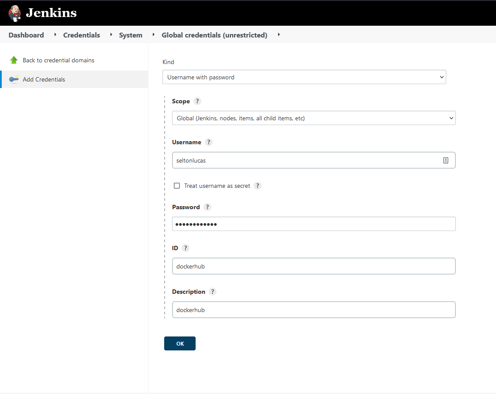
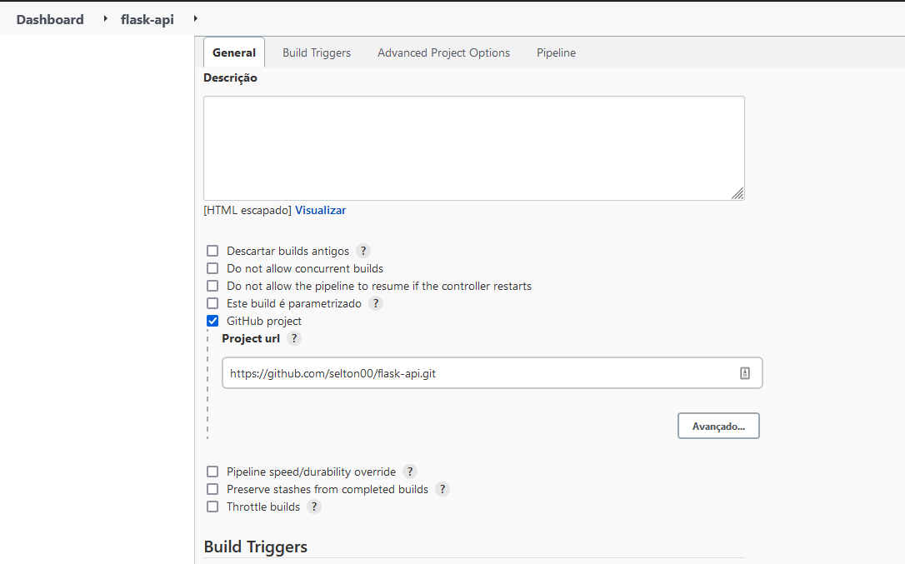
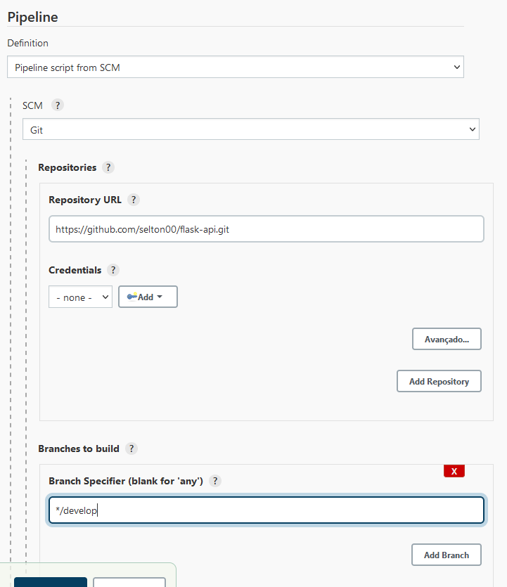

# Avaliação DevOps

Esse repositorio é um fork do flask-api mas só irei utilizar o ambiente virtual e o example.py

## Dockerfile flask-api

- Primeiro eu extraio as depedencias com o pipenv

``` 
$ pipenv sync
$ pipenv run pip freeze > requirements.txt
```

Depois foi criado a Dockerfile para o app

- Para buildar a imagem, podemos utilizar:

``` 
$ docker build -t seltonlucas/flask-api:v1 .
```

- E para testar:

``` 
$ docker container run --name flask-api --rm -d -p 5000:5000 seltonlucas/flask-api:v1
```

## Docker Compose

No arquivo docker-compose.yaml foi configurado o volume persistente e a rede do banco de dados
utilizamos a imagem e a versão criadas acima para app, para o banco de dados foi utilizado a imagem mysql:8.0 e definida as váriaveis de ambiente

- para rodar o arquivo utilizamos

``` 
$ docker-compose --env-file ./.env up -d 
```

## Jenkins Container

No repositorio há um diretorio `/jenkins_config` destinado as configurações do Jenkins

O dockerfile do serviço define as configurações para utilizar o Jenkins Configuration as Code(JCasC).
Temos um arquivo que define parametros de segurança, desabilitamos sign up de novos usuários e o login e senha do administrador como váriaveis.
E o outro define os plugins necessários para construímos nossa pipeline

- Para buildarmos a imagem do Jenkins utilizamos

``` 
$ docker build -t jenkins:jcasc .
```

- E para iniciarmos 

``` 
$ docker container run --name jenkins -d --rm -v /var/run/docker.sock:/var/run/docker.sock -p 8080:8080 --env JENKINS_ADMIN_ID=admin --env JENKINS_ADMIN_PASSWORD=password jenkins:jcasc
```

Nós definimos aqui o usuário e a senha mas essas váriaveis podem ser definidos por metodos mais seguros.
Para rodar pipelines usando o docker no Jenkins é necessário utilizar o conceito de docker in docker.

## Jenkins Pipeline

Para criar uma pipeline no Jenkins foi criado a Jenkinsfile no diretorio principal

- Para buildar a imagem e enviar para o dockerhub precisamos configurar as credenciais que são definidas na parte de segurança do programa



- E utilizamos esse repositorio no github para criar um job que irá executar a pipeline





Na configuração também podemos definir de quanto em quanto tempo a pipeline será executada.
Podemos por exemplo, definir que a cada push neste repositorio a pipeline irá criar a imagem e enviar para o repositorio remoto

